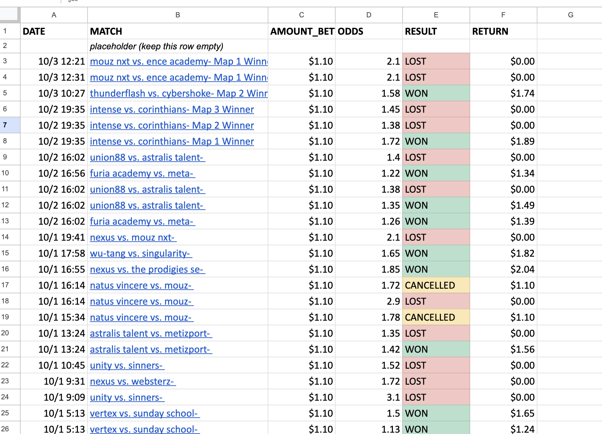
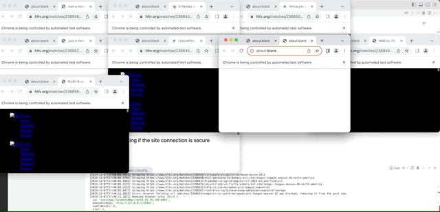

# HLTV Scraper Project

## Summary

This was a nearly year-long endeavor with the end goal of reliably betting upon professional Counter-Strike (CS) matches. It taught me about managing complexity and persisting through obstacles. In this README, I'll go through the different components of this project and stages of its development.

## Underlying Idea

I had entertained this idea in high school, building out the scraping program and scraping all available matches before realizing I didn't have the machine learning knowledge to do anything with it. Now, with more ML understanding and more experience with complex projects, I decided to try again.

This idea was based upon a few fundamental assumptions:

1. The only source of high-quality Counter-Strike match data is through scraping HLTV.com.
   - HLTV is a CS website with stats, news, and forums, but its Cloudflare protection makes scraping hard.
   - If this is true, then scraping it all would be a barrier to entry for other people with this same idea.
2. It is possible to profit with a relatively low accuracy.
   - My goal with my machine learning model was to achieve an accuracy of 60-70%, and then make my bets in a way that would make that accuracy profitable.
   - I figured being that accurate consistently would outcompete most other bettors who lack a consistent model.
3. Successful betting strategies won't be punished by betting websites.
   - I used Thunderpick, a crypto-currency based betting site, which I assume wouldn't have the resources build a model of their own or keep track of successful bettors.

My philosophy was to try and overcome every problem I faced so long as the fundamental assumptions held up, and I only stopped this project once one of them proved wrong.

## Scraping

The first stage was scraping. I chose Node & Typescript for my scraping module, because of my familiarity with Node, and because Typescript would make the project less error-prone. I used puppeteer and cheerio for scraping, with Puppeteer imitating a browser, fetching the pages, then passing the HTML to cheerio which extracts the data from the DOM. Then, the parsed data would be sent to a MongoDB database in the cloud. Much of this was straightforwad, with the real challenge being twofold:

1. The volume of data to scrape (hundreds of thousands of matches, maps, players, and events).
2. Overcoming Cloudflare, which prevented headless scraping.

Problem 1 necessitated parallelization. Instead of running all the pages through a single puppeteer browser, I had a bank of browsers that, when available, would take and process the next page from a long queue of pages. To prevent overwhelming HLTV servers or getting blocked, I ran each browser through a different proxy. Parallelization also caused problems for the database, as it would get overwhelmed by queries. I previously would just use `await` on all DB processes, but beyond holding up the browsers, who had to wait for the database, one long/hanging DB query would lead to a backlog of other queries which would sometimes crash the database, and sometimes cause me to run out of RAM. So, I refactored the DB calls to use promises, and added a kind of middleware that passed every query to a global promise queue which would manage these parallel calls much faster and without error. This prevented crashes and allowed the browsers to operate continuously without waiting for the DB. I also ended up giving the puppeteer calls their own promise queue as well, which improved performance on their end.

Problem 2 necessitated several things. First, I used `puppeteer-extra-plugin-stealth`, a package that configured puppeteer's settings to be less detectable, but it wasn't too effective. Switching to headful browsers (ie. browsers opened with the full GUI instead of just simulated on the command line) helped, but some of my proxy's IPs would be blocked, others wouldn't overcome the Cloudflare challenges, and others would get other mysterious internet-based errors. The solution was to maintain a list of IPs longer than the amount of browsers running concurrently, and I used a 100-25 ratio for most of the project. That way, any time a browser or its IP had a problem, we could close it and open a new browser with an unused IP. At the end of every week, the provider would refresh the proxy IPs, so I never had an issue with getting blocked. This made deployment challenging though.

## Predicting

### Features

Once I had a full database, I started working on the machine learning component of this project. Without much experience in that field, it was a lot of trial and error, with most of the work going into processing the data.

I approached feature selection by recalling the betting intuitions of myself and others, and by watching matches and carefully asking "why did they win?"
One answer to that question came down to current form, which could be extracted from recent matches or matches earlier in the same event. Other factors were the players' experience on the match's map, their consistency, and the matchup between different player types. One important conclusion was the role of random chance deciding pivotal moments in a given match, so, by my philosophy, consistency was vital in a team being able to overcome those random occurrences.

My ultimate approach was the following:

- For each match, fetch its players previous matches over a timeframe or timeframes
- Then, iterate through those previous matches, extracting statistics about that player's performance, and about the team's performance
  - Statistics included things like rating, kill count, and performance against adversaries from the predicted match
- Categorize those statistics based on the relationship between this previous match and the predicted match
  - If this previous match was on the same map as the predicted, or if this previous match was in the same event or location
- For each category and player, aggregate the collected statistics into columns to get the final feature matrix
  - Includes getting team-wide win rates, average and stdev per-player stats, etc.

Other features were untethered to performance, including event prize pools, player ages, and the time each team's roster had spent together.

### The model

### Results

## Betting

## Deployment

Scraping a couple hundred thousand webpages, even with dozens of browsers, would take around 20 hours. I didn't want to leave it constantly running on my laptop, even though scraping sessions could fail safely, with the next session picking up where the previous left off. My end goal was having this running in the cloud continuously.

## Conclusion
